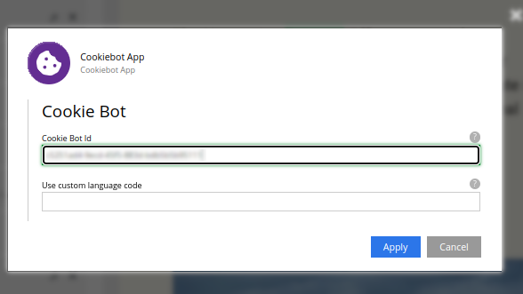
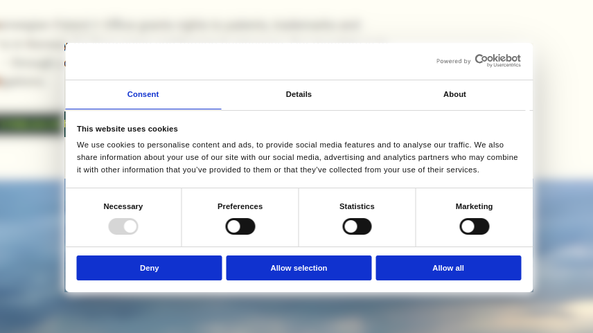

# Cookiebot App

Cookiebot App (cookiebot-app) enables Enonic XP sites to use Cookiebot just setting a cbid, adding the auto blocking banner script to the pages.

## Usage

Install the application in a site and set a proper cbid value in the `Cookiebot Id` config field.

It's also possible to set a banner language to all visitors by setting the `Use custom language code` config field.

A banner example, as set-up in Cookiebot Admin.

## Deploy locally

Run `./gradlew deploy` to see the available commands.
